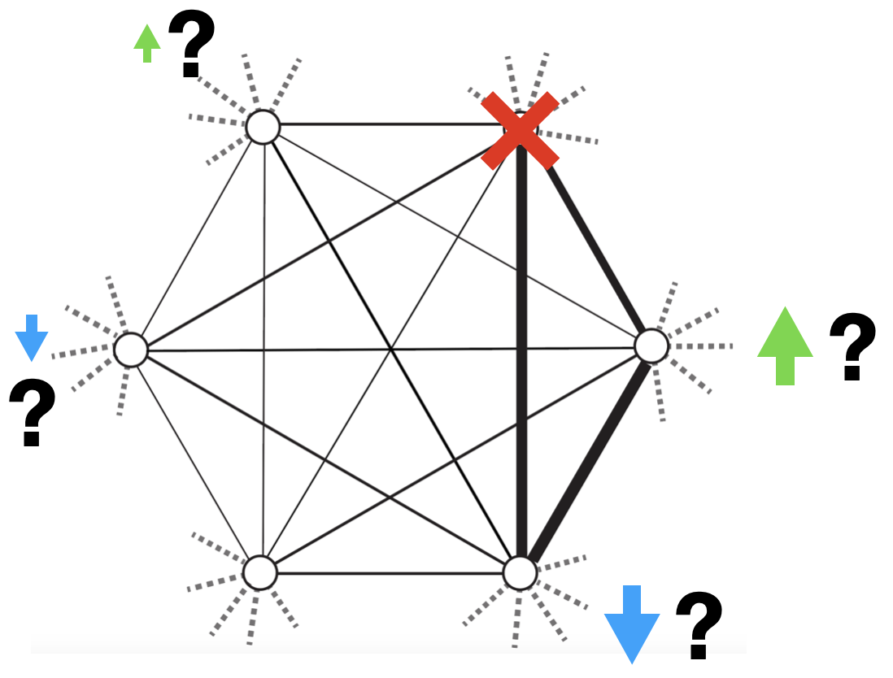

## Abstract

A common tool for assessing network structure is to remove highly connected nodes and measure how the network responds to the change. This tool is often used to assess yeast regulatory network structure by deleting conserved transcription factors in different genetic backgrounds. Network structure can then be compared by identifying which genes are differentially expressed relative to wildtype. Many recent studies have found, however, that the set of genes that are differentially expressed in response to a given transcription factor deletion can be remarkably different for different genetic backgrounds. Even between strains of the same species, the same transcription factor deletion tends to affect different suites of genes. These studies further suggest that the majority of affected genes are indirect targets of the deleted transcription factor. Here, we investigate whether differences in the wildtype network structure between two species of yeast, Saccharomyces cerevisiae and Saccharomyces paradoxus, are predictive of differences in their response to the same 46 transcription factor deletions. We first compare the wildtype expression response in both species and their F1 hybrid in response to nitrogen limitation, a well-characterized gene expression response pathway in yeast. We find that most differences in network structure observed between species are dominant in the hybrid, suggesting that most network rewiring is driven by changes in the presence or absence of regulatory connections, as opposed to changes in the strength or direction (activating or repressing) of regulatory connections. When we compared the sets of differentially expressed genes in response to each of the 46 transcription factor deletions, we indeed find that the majority of affected genes are different for each species. Additionally, many deletions have even stronger effects in the F1 hybrid, suggesting that the presence of both species' regulatory networks exacerbates the number of affected genes. Next we investigate whether the regulatory connections that are unique to each species are predictive of differences in their gene expression response to each transcription factor deletion. Collectively our work highlights the widespread changes in regulatory network structure that are rapidly evolving, even between closely related species.

```{r pressure, echo=FALSE, fig.align="center", out.width = '50%'}

```
